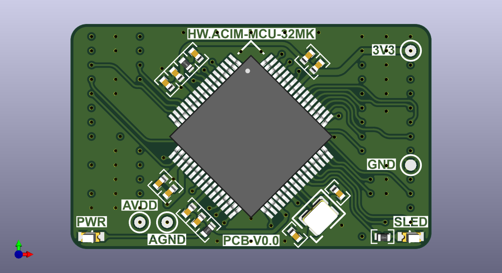
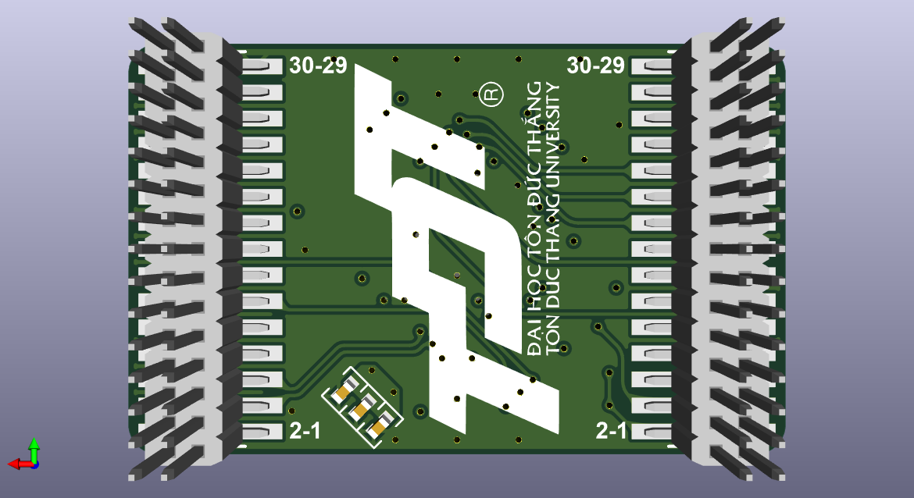

# AC INDUCTION MOTOR - INVERTER BOARD V1.0

## 1. Schematic

### 1.1. Inverter board

[Revision 1.0](V1/Productions/HW.ACIM-INV-V1.0/Sch/HW.ACIM-INV.pdf).

### 1.2. MCU board

[HW.ACIM-MCU-32MK Revision 0.0](V1/Productions/HW.ACIM-MCU-32MK/Sch/HW.ACIM-MCU-32MK.pdf).

## 2. PCB

### 2.1. Inverter board

.png)

.png)

.png)

.png)

.png)

### 2.2. MCU board

HW.ACIM-MCU-32MK Revision 0.0

